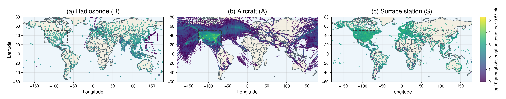
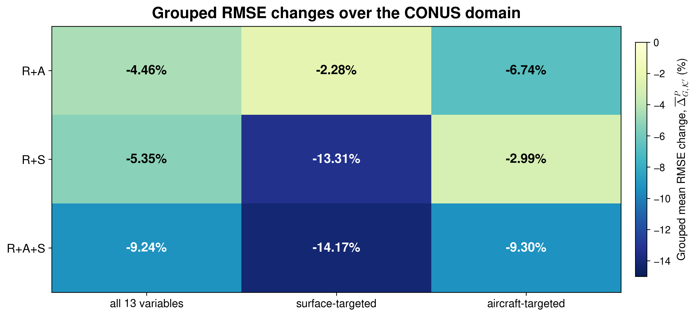

# Generative Atmospheric Super-Resolution across Heterogeneous Observing Systems through Composable Interfaces

[Release v1.0.0](https://github.com/ISCLPurdue/generative_multimodal_atmospheric_super_resolution/releases/tag/v1.0.0)
· [Data and model inputs](DATA.md)
· [Reproduction](reproduction/README.md)
· [Reported analyses](analysis/README.md)
· [Citation](#citation)

This repository provides the research code and experiment metadata supporting
the manuscript *Generative Atmospheric Super-Resolution across Heterogeneous
Observing Systems through Composable Interfaces*. It implements diffusion
posterior sampling with a fixed 13-variable atmospheric diffusion prior and
three observation sources:

- **R:** radiosonde profiles from the Integrated Global Radiosonde Archive
  (IGRA);
- **A:** aircraft reports from the NOAA Meteorological Assimilation Data Ingest
  System (MADIS) Aircraft Based Observations (ABO) product; and
- **S:** surface-station reports from the NOAA MADIS Meteorological Aerodrome
  Report (METAR) product.

The observation interfaces specify which measurements are retained, how they
are mapped to the gridded state, how residuals are counted, and how each source
contributes to the likelihood. The paper develops and calibrates these
interfaces with 2019 observations and evaluates the selected configuration at
723 analysis times in 2020.



*Annual 2020 spatial distributions of IGRA radiosonde profiles (R), MADIS ABO
aircraft reports (A), and MADIS METAR surface-station reports (S). Dashed boxes
mark the CONUS domain used for A and S.*

## Main result

Across 723 matched analysis times in 2020, R+A+S reduced the mean CONUS RMSE
across all 13 state variables by **9.24%** and the corresponding CRPS by
**9.98%** relative to R-only conditioning.



*Grouped mean RMSE changes for R+A, R+S, and R+A+S relative to R-only
conditioning. Negative values indicate lower RMSE.*

## Repository map

| Goal | Start here |
|---|---|
| Run the 2020 experiments | [`reproduction/`](reproduction/README.md) |
| Prepare the required inputs | [`DATA.md`](DATA.md) |
| Reproduce reported analyses | [`analysis/`](analysis/README.md) |
| Inspect the sampler and observation interfaces | [`src/igra_gen/`](src/igra_gen/) |
| Inspect preprocessing and interface-development scripts | [`scripts/`](scripts/) |
| Run configuration and paper-alignment checks | [`tests/`](tests/) |

## Quick start

The experiments used Python 3.11 and PyTorch on NVIDIA A100 GPUs. Create an
environment and install the Python dependencies with:

```bash
python -m venv .venv
source .venv/bin/activate
python -m pip install --upgrade pip
python -m pip install -r requirements.txt
export PYTHONPATH="$PWD/src:${PYTHONPATH:-}"
```

Inspect the annual evaluation interface with:

```bash
python reproduction/run_2020_evaluation.py --help
```

The complete annual and held-out-observation commands are documented in
[`reproduction/README.md`](reproduction/README.md).

## Data and model requirements

This repository does not redistribute ERA5 fields, NOAA observations,
processed observation products, trained model weights, or generated posterior
samples. Their expected roles and public providers are documented in
[`DATA.md`](DATA.md). The public wrappers accept all data, checkpoint, and
output locations as command-line arguments and do not require the original
Purdue filesystem layout.

The selected interface settings are recorded in
[`reproduction/config/selected_interface_2019.json`](reproduction/config/selected_interface_2019.json),
and the fixed annual and held-out evaluation times are recorded under
[`reproduction/manifests/`](reproduction/manifests/). The wrappers reproduce
the posterior-sampling stage; downstream scripts and compact numerical
summaries are documented under [`analysis/`](analysis/README.md).

## Citation

Citation metadata are provided in [`CITATION.cff`](CITATION.cff). For a fixed
software snapshot, please cite the
[`v1.0.0` release](https://github.com/ISCLPurdue/generative_multimodal_atmospheric_super_resolution/releases/tag/v1.0.0).
The associated manuscript citation will be added after the preprint is posted.
This repository does not require a Zenodo DOI.

## License

Third-party code embedded in individual source files retains its original
copyright and license notices. No project-wide license has yet been assigned;
all rights not covered by those notices are reserved by the authors.

## Acknowledgments

We acknowledge support from DARPA Award HR0011-26-3-E050 (POC: Yannis
Kevrekidis).

## Authors

Yang Xu, Dibyajyoti Chakraborty, Haiwen Guan, Sen Wang, and Romit Maulik.
