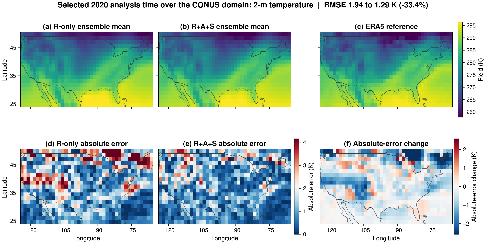
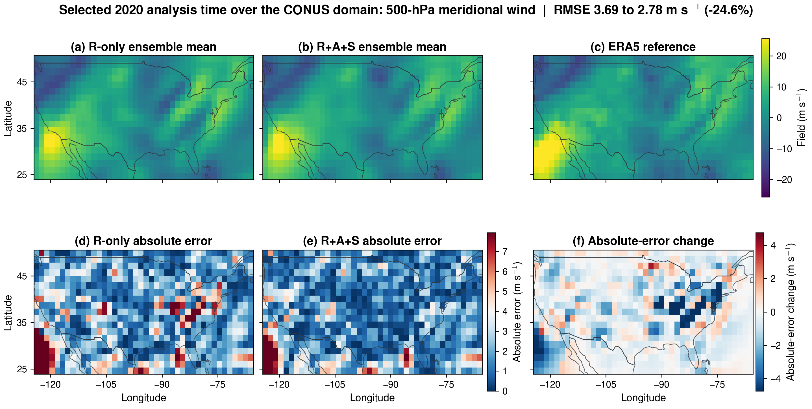

# Generative Atmospheric Super-Resolution across Heterogeneous Observing Systems through Composable Interfaces

[Data and model inputs](DATA.md)
· [Reproduction](reproduction/README.md)
· [Reported analyses](analysis/README.md)
· [Citation](#citation)

This repository provides the research code and experiment metadata supporting
the manuscript *Generative Atmospheric Super-Resolution across Heterogeneous
Observing Systems through Composable Interfaces*. It implements diffusion
posterior sampling with a fixed 13-variable atmospheric diffusion prior and
three observation sources:

- **R:** radiosonde profiles from the Integrated Global Radiosonde Archive
  (IGRA);
- **A:** aircraft reports from the NOAA Meteorological Assimilation Data Ingest
  System (MADIS) Aircraft Based Observations (ABO) product; and
- **S:** surface-station reports from the NOAA MADIS Meteorological Aerodrome
  Report (METAR) product.

The observation interfaces specify which measurements are retained, how they
are mapped to the gridded state, how residuals are counted, and how each source
contributes to the likelihood. The paper develops and calibrates these
interfaces with 2019 observations and evaluates the selected configuration at
723 analysis times in 2020.


*Annual 2020 spatial distributions of IGRA radiosonde profiles (R), MADIS ABO
aircraft reports (A), and MADIS METAR surface-station reports (S). Dashed boxes
mark the CONUS domain used for A and S.*

## Example reconstructions

The same selected 2020 analysis time illustrates how the R+A+S conditioning
configuration changes a surface and an upper-air reconstruction relative to
R-only conditioning. This case is illustrative; the annual comparison across
all 723 matched analysis times follows in [Main result](#main-result).



*Selected 2 m temperature example. The CONUS RMSE decreases from 1.94 to
1.29 K. In panel (f), blue indicates lower absolute error under R+A+S than
under R-only conditioning.*



*Selected 500 hPa meridional-wind example at the same analysis time. The CONUS
RMSE decreases from 3.69 to 2.78 m s⁻¹. In panel (f), blue indicates
lower absolute error under R+A+S than under R-only conditioning.*

## Main result

Across 723 matched analysis times in 2020, R+A+S reduced the mean CONUS RMSE
across all 13 state variables by **9.24%** and the corresponding CRPS by
**9.98%** relative to R-only conditioning.


*Grouped mean RMSE changes for R+A, R+S, and R+A+S relative to R-only
conditioning. Negative values indicate lower RMSE.*

## Repository map

| Goal | Start here |
|---|---|
| Run the 2020 experiments | [`reproduction/`](reproduction/README.md) |
| Prepare the required inputs | [`DATA.md`](DATA.md) |
| Inspect reported analyses and compact outputs | [`analysis/`](analysis/README.md) |
| Inspect the sampler and observation interfaces | [`src/igra_gen/`](src/igra_gen/) |
| Inspect observation-preprocessing scripts | [`scripts/`](scripts/) |
| Run configuration and paper-alignment checks | [`tests/`](tests/) |

## Quick start

The experiments used Python 3.11 and PyTorch on NVIDIA A100 GPUs. Create an
environment and install the Python dependencies with:

```bash
python -m venv .venv
source .venv/bin/activate
python -m pip install --upgrade pip
python -m pip install -r requirements.txt
export PYTHONPATH="$PWD/src:${PYTHONPATH:-}"
```

Inspect the annual evaluation interface with:

```bash
python reproduction/run_2020_evaluation.py --help
```

Run the repository checks with:

```bash
python -m unittest discover -s tests -v
```

The complete annual and held-out-observation commands are documented in
[`reproduction/README.md`](reproduction/README.md).

## Data and model requirements

This repository does not redistribute ERA5 fields, NOAA observations,
processed observation products, trained model weights, or generated posterior
samples. [`DATA.md`](DATA.md) identifies the public providers for the source
observations and ERA5 and documents the local formats expected for all external
inputs. The public wrappers accept all data, checkpoint, and output locations
as command-line arguments and do not require the original filesystem layout.

The selected interface settings are recorded in
[`reproduction/config/selected_interface_2019.json`](reproduction/config/selected_interface_2019.json),
and the fixed annual and held-out evaluation times are recorded under
[`reproduction/manifests/`](reproduction/manifests/). The wrappers reproduce
the posterior-sampling stage; downstream scripts and compact numerical
summaries are documented under [`analysis/`](analysis/README.md).

The repository includes the inference architecture and resolved configuration
for the fixed atmospheric prior used in the study, but not its original
training pipeline. The pretrained checkpoint, processed fields and
observations, and posterior arrays are external inputs. The release is
therefore a paper-aligned research-code and analysis snapshot rather than a
self-contained data-and-model distribution.

## Citation

Citation metadata are provided in [`CITATION.cff`](CITATION.cff). For a fixed
software snapshot, please cite the GitHub release associated with the version
used.
The associated manuscript citation will be added after the preprint is posted.

## License

This project is released under the [MIT License](LICENSE).

## Acknowledgments

We acknowledge support from DARPA Award HR0011-26-3-E050 (POC: Yannis
Kevrekidis).

## Authors

Yang Xu, Dibyajyoti Chakraborty, Haiwen Guan, Sen Wang, and Romit Maulik.
